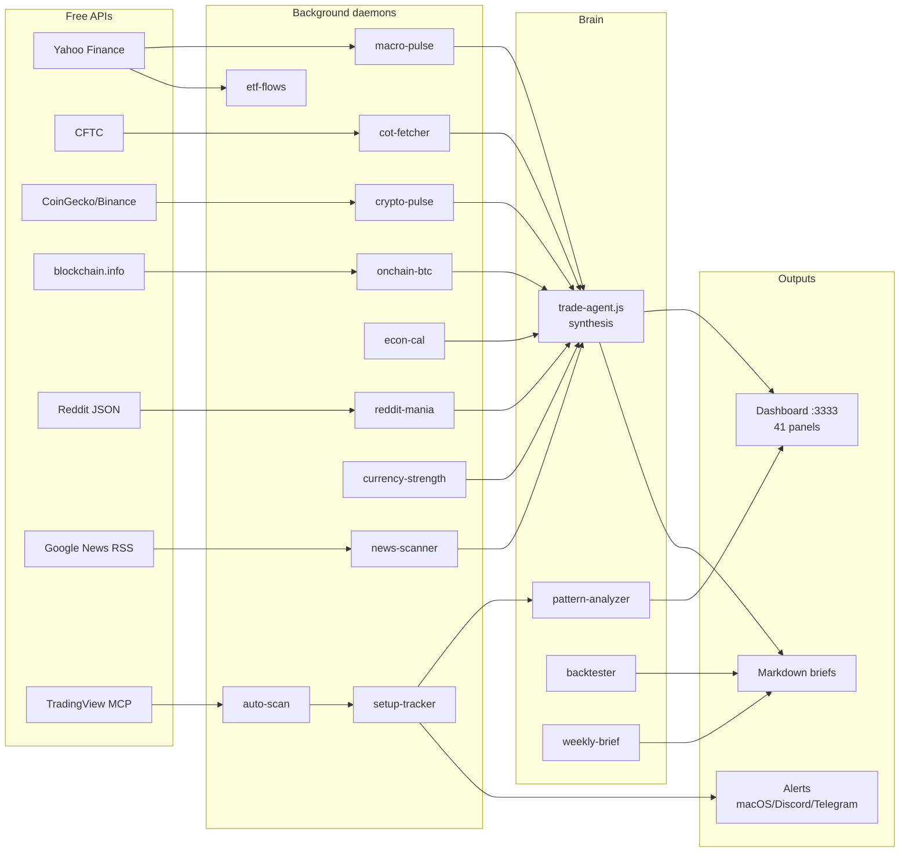

<div align="center">

# 🤖 TradeBobby

**A Bloomberg-style market intelligence terminal for ICT/SMC macro trading.**

Open-source, self-hosted, runs on your laptop. Synthesizes 15+ free data sources into a single decision-grade dashboard, generates trade ideas with multi-factor confluence scoring, and ships a 1900-line Pine Script V6 indicator for TradingView.

[](https://nodejs.org)
[](https://www.tradingview.com/pine-script-docs/)
[](LICENSE)
[](https://github.com/SoCloseSociety)

[Features](#-features) · [Architecture](#-architecture) · [Quick start](#-quick-start) · [Pine V6](#-pine-script-v6) · [Roadmap](NEXT_PHASES.md)

</div>

---

## What it is

TradeBobby is a **research desk in a box** for systematic discretionary traders who follow ICT/SMC methodology and trade macro narratives. It runs locally, pulls free data from 15+ public sources every 5-30 minutes, and renders a single dense terminal that tells you:

- 🎚 **What regime we're in** (0-100 Composite Risk Index)
- 📡 **What just happened** (live news triggers + sentiment shifts)
- 🏛 **Who's positioned how** (CFTC COT extremes, retail mania spikes, ETF flows)
- 🎯 **Where the highest-quality setup is forming** (multi-source synthesis with conviction scoring)
- ⏱ **What's about to hit** (next catalyst countdown -- NFP, CPI, FOMC, earnings)

It does **not** execute trades, send orders, or manage your capital. It's a decision support tool. You stay in the driver's seat.

---

## ✨ Features

### 🖥 Web terminal (`localhost:3333`)

```
┌───────────────────────────────────────────────────────────────────────┐
│ STATUS  REGIME │ VIX │ DXY │ GOLD │ WTI │ F&G │ 10Y │ NEWS │ TRIG │…  │  ← live status bar (13 cells)
├───────────────────────────────────────────────────────────────────────┤
│ TICKER  scroll across all watchlist symbols (24-hour ticker tape)     │
├───────────────────────────────────────────────────────────────────────┤
│ ⏱ NEXT CATALYST T-4h 32m · NFP 13:30 UTC → DXY/Gold/NAS/USDJPY        │
│ 🚨 SETUP A+ LONG XAGUSD entry $32.18 SL $31.40 TP2 $34.50 score 9     │
├───────────────────────────────────────────────────────────────────────┤
│ 🤖 Agent Brief -- multi-source synthesis (Regime + Top 4 ideas + ...)  │
│ 📡 Market Wrap -- narrative auto-generated, Bloomberg style             │
├──────────┬────────────┬──────────────┬──────────────────────────────┤
│ 🎚 Risk  │ ⚙️ State  │ 🎯 Top Sig   │ ⭐ Watchlist  │ ⚡ Killzones    │
│ Index    │ regime    │ live entry   │ starred syms  │ live timers     │
│ gauge    │ confl.    │ + R:R + TV   │               │                 │
├──────────┴───────────┴──────────────┴──────────────────────────────────┤
│ 📊 Heatmap (filterable: FX/IDX/CRYPTO/METALS/OIL/★)                   │
│   click-left = TradingView · right-click = star/unstar in watchlist   │
├──────────────────────────────────────────────────────────────────────┤
│ 📈 Macro Pulse │ 🪙 Crypto Pulse │ 📉 Yield Curve │ 🔄 Sector Rotation│
│ 🏛 COT         │ ⛓ On-chain     │ 💱 Currency    │ 📐 VIX Term       │
│ 🦍 Reddit      │ 🔥 Mag-7       │ 📊 Earnings   │ 🎯 Setup Tracker  │
├──────────────────────────────────────────────────────────────────────┤
│ 🚨 Alerts Center  │ 📈 Sentiment 24h Chart                            │
├──────────────────────────────────────────────────────────────────────┤
│ 📡 Live News Stream (40 most recent, categorized)                     │
└──────────────────────────────────────────────────────────────────────┘
```

**41 panels** · **31 API endpoints** · **6 sticky bars** · Bloomberg-style density.

### ⌨ Bloomberg-style command palette (⌘K / Ctrl+K)

Type `XAU DES` to open Gold detail, `BTC GIP` to open chart, `EUR CN` for filtered news, `OIL STAR` to star.

Aliases for everything: `XAU → XAUUSD`, `NQ → NAS100`, `CABLE → GBPUSD`, etc.

### 🔔 Multi-channel alerts

- **macOS native** notifications (built-in, sound included)
- **Discord webhook** (opt-in via `DISCORD_WEBHOOK_URL` env var)
- **Telegram bot** (opt-in via `TELEGRAM_BOT_TOKEN` + `TELEGRAM_CHAT_ID`)
- **Audio bip** via Web Audio API (browser, toggleable)
- **Sticky banner** at top of dashboard for A+ signals

### 📈 Pine Script V6 indicator

**1931 lines · 40 alerts · 132 inputs · 13 V6 modules** on top of a robust V5 ICT/SMC base.

Drop it on any TradingView chart, get:
- Structure (BOS/CHoCH/swing labels)
- Order Blocks with displacement validation
- Fair Value Gaps with proper mitigation tracking
- Liquidity (equal H/L + sweep detection)
- Premium/Discount zones
- Multi-timeframe bias dashboard (D + 4H + 1H + current)
- Anchored VWAP (daily + weekly, optional std-dev bands)
- VIX risk-off background (fetches `TVC:VIX`)
- Killzone background highlights (Asia / London / NY overlap)
- HTF FVG projection (4H + Daily projected onto current TF)
- Breaker blocks · Inverse FVG · Mitigation blocks · Liquidity voids
- ⭐ **Stacked Confluence Zones** -- flag when 3+ structures overlap

See [PINE_V6_CHANGELOG.md](PINE_V6_CHANGELOG.md) for module-by-module breakdown.

### 🧠 Multi-source synthesis agent

`trade-agent.js` reads ALL data sources every 15 min and outputs:
- Regime classification (RISK-ON/MIXED/RISK-OFF with confidence score)
- Composite Risk Index (0-100, weighted by 9 factors)
- Top 5 trade ideas with synthesis score (boosted/penalized by COT extremes, currency strength, sector rotation, news sentiment, historical WR per symbol)
- Divergence detection (news-vs-price, VIX-vs-news, COT crowded vs setup direction)
- Upcoming catalyst list (econ events + earnings)

### 🏛 Free data sources (all public APIs, no auth)

| Source | What | Refresh |
|---|---|---|
| Yahoo Finance | DXY, VIX, US yields, sector ETFs, Mag-7, futures | 5 min |
| CFTC publicreporting | Commitment of Traders (20 markets) | 6 hours |
| alternative.me | Crypto Fear & Greed Index | 5 min |
| CoinGecko | BTC/ETH dominance, global mcap | 5 min |
| Binance perpetuals | Funding rates (12 tracked + extremes) | 5 min |
| blockchain.info | BTC hashrate, supply, difficulty | 10 min |
| mempool.space | BTC fees, congestion | 10 min |
| Google News RSS | News (60+ feeds, 8 categories, sentiment scoring) | manual/cron |
| NASDAQ | Earnings calendar (Mag-7 + 50 tickers) | 12 hours |
| Reddit (no auth) | r/wsb + r/CryptoCurrency mention spikes | 30 min |
| TradingView MCP Jackson | Live price scans + V5 ICT signals | 4 hours (cron) |

---

## 🏗 Architecture



---

## ⚡ Quick start

### Requirements

- macOS or Linux
- Node.js 22+
- (Optional) [TradingView MCP Jackson](https://github.com/0xJackson/tradingview-mcp) for live ICT/SMC scans
- (Optional) Chrome for `cdp` + TradingView desktop login

### Install

```bash
git clone https://github.com/SoCloseSociety/TradeBobbyTerminal.git
cd TradeBobby
npm install --prefix dashboard

# Generate first data snapshot
cd dashboard
node macro-pulse.js
node crypto-pulse.js
node cot-fetcher.js
node news-scanner.js
node trade-agent.js

# Launch dashboard + 14 background daemons
bash manage.sh start

# Open in browser
open http://localhost:3333
```

### Verify everything works

```bash
bash manage.sh status   # process state + /api/health summary
bash manage.sh test     # full 86-check smoke test
```

Expected: `🟢 ALL HEALTHY · 86/86 PASS`.

### Optional integrations

```bash
# Discord webhook alerts
export DISCORD_WEBHOOK_URL="https://discord.com/api/webhooks/..."
bash manage.sh restart setup-alerter

# Telegram bot alerts
export TELEGRAM_BOT_TOKEN="..."
export TELEGRAM_CHAT_ID="..."
bash manage.sh restart setup-alerter

# Claude API narrator (3-paragraph regime brief every 4h)
export ANTHROPIC_API_KEY="sk-ant-..."
bash manage.sh restart claude-narrator

# TradingView MCP scans (live ICT/SMC signals)
export TV_MCP_DIR="$HOME/tradingview-mcp-jackson"
node auto-scan.js
```

### Auto-recovery

```bash
# One-shot check + restart dead processes
bash manage.sh watchdog

# Continuous monitoring (background, checks every 60s)
nohup bash watchdog.sh --loop > /tmp/watchdog.log 2>&1 &
```

---

## 📊 Pine Script V6

Copy [`Pro_Trading_System_V5.pine`](Pro_Trading_System_V5.pine) into TradingView Pine Editor → **Add to chart**.

### 13 V6 modules added on top of V5 base

| # | Module | Concept | Alerts |
|---|---|---|---|
| 1 | 🟥 VIX Risk Filter | tints background when VIX > threshold, optional block longs | 3 |
| 2 | 📊 Anchored VWAP | Daily + Weekly + optional std-dev bands | 4 |
| 3 | ⚡ Killzone background | Asia / London / NY overlap highlights | 2 |
| 4 | 🔄 Breaker Blocks | OBs broken in opposite direction → reversed S/R | -- |
| 5 | 🧭 Multi-TF Bias | D + 4H + 1H + Cur EMA alignment composite | 3 |
| 6 | ↔️ Inverse FVG | FVGs closed-through invert their role | 1 |
| 7 | 🎯 OTE Swing zone | auto-draws Fib 0.62-0.79 from latest swing | -- |
| 8 | 🚫 News Blackout | suppresses signals around NFP/CPI/FOMC/ECB | 2 |
| 9 | 🔱 Power of 3 (AMD) | Asia accumulation / London manipulation / NY distribution | 2 |
| 10 | 📈 HTF FVG | 4H + Daily FVGs projected on current chart | 4 |
| 11 | 💨 Liquidity Voids | extreme imbalance candles > N × ATR | 1 |
| 12 | 🔄 Mitigation Blocks | clean impulse origin zones | 2 |
| 13 | ⭐ Stacked Confluence | flags when 3+ structures overlap at price (the killer module) | 1 |

Combined with the V5 engine: structure, OBs, FVGs, liquidity sweeps, key levels, premium/discount, sessions, HTF bias, confluence (0-10), entry signals with cooldown/zone/direction filters, R:R calc, dashboard.

---

## 📂 Project structure

```
TradeBobby/
├── README.md                        ← you are here
├── PINE_V6_CHANGELOG.md             ← Pine V6 module-by-module
├── DAILY_WATCHLIST.md               ← 7 tiers, ~100 charts, daily routine
├── AGENT_ARCHITECTURE.md            ← agent design
├── NEXT_PHASES.md                   ← roadmap (10 future phases)
├── CLAUDE.example.md                ← config template (copy to CLAUDE.md)
├── MARGIN_STRATEGY.example.md       ← strategy template
├── Pro_Trading_System_V5.pine       ← Pine V6 indicator (1931 lines)
│
└── dashboard/
    ├── server.js                    ← Express + HTML (3400 lines, 31 endpoints, 41 panels)
    ├── package.json
    │
    ├── manage.sh                    ← unified control: start/stop/status/logs/health/test
    ├── watchdog.sh                  ← auto-restart dead processes
    ├── smoke-test.sh                ← 86-check verification
    ├── start-agent.sh               ← legacy one-shot startup
    │
    ├── _log-helper.js               ← shared bounded logger (1MB cap, 1000-line tail)
    │
    │ ── data fetcher daemons ──
    ├── auto-scan.js                 ← TradingView MCP scanner (V5 ICT/SMC)
    ├── generate-setups.js           ← V5 setup engine
    ├── scan.js
    ├── news-scanner.js              ← Google News RSS + sentiment + triggers
    ├── econ-calendar.js             ← macro events
    ├── macro-pulse.js               ← Yahoo Finance: DXY/VIX/yields/sectors/Mag-7 (52 tickers)
    ├── crypto-pulse.js              ← F&G + dominance + funding
    ├── cot-fetcher.js               ← CFTC institutional positioning (20 markets)
    ├── onchain-btc.js               ← hashrate, fees, halving countdown
    ├── earnings-cal.js              ← NASDAQ earnings (Mag-7 + key tickers)
    ├── reddit-mania.js              ← r/wsb + r/CryptoCurrency mention spikes
    ├── currency-strength.js         ← FX relative strength meter
    ├── etf-flows.js                 ← BTC/ETH/Gold/Silver/Credit ETF flow proxy
    ├── setup-tracker.js             ← V5 signal performance logger
    ├── setup-alerter.js             ← A+ signal notify (macOS + Discord + Telegram)
    │
    │ ── synthesis layer ──
    ├── trade-agent.js               ← multi-source synthesis brief (every 15min)
    ├── weekly-brief.js              ← Sunday retrospective (regime, signals, takeaways)
    ├── backtester.js                ← analyze scan_history + setup_history
    ├── pattern-analyzer.js          ← combo win-rate detection
    ├── claude-narrator.js           ← Anthropic API narrative (opt-in)
    ├── tts-narrator.js              ← macOS `say` regime narration
    │
    ├── profiles/                    ← 4 trading profiles (preset configs)
    │   ├── scalp.json
    │   ├── swing.json
    │   ├── aggressive.json
    │   └── conservative.json
    │
    └── legacy/                      ← archived optional integrations
        ├── backtest.js              ← legacy backtest engine
        ├── broker-icmarkets.js      ← MetaApi cloud (MT4/5)
        └── broker-ctrader.js        ← cTrader Open API
```

---

## 🛰 Background daemons

14 lightweight Node processes that fetch and refresh data independently. All managed via `manage.sh`.

| Daemon | Cadence | Data |
|---|---|---|
| `macro-pulse` | 5 min | 52 tickers (DXY/VIX/yields/sectors/Mag-7/futures) |
| `crypto-pulse` | 5 min | F&G + dominance + funding rates |
| `cot-fetcher` | 6 hours | CFTC weekly (Friday updates) |
| `onchain-btc` | 10 min | Hashrate + fees + halving countdown |
| `earnings-cal` | 12 hours | NASDAQ earnings 14-day window |
| `reddit-mania` | 30 min | Retail mention spikes |
| `currency-strength` | 5 min | FX relative strength |
| `etf-flows` | 30 min | 15 institutional ETF volume/flow signals |
| `setup-tracker` | 15 min | V5 signal performance (per quality/symbol/dir) |
| `setup-alerter` | 1 min | A+ signal watcher → multi-channel notify |
| `trade-agent` | 15 min | Multi-source synthesis brief |
| `tts-narrator` | 2 hours | macOS `say` regime narration (active sessions only) |
| `claude-narrator` | 4 hours | Anthropic API narrative (opt-in) |
| `weekly-brief` | weekly | Sunday retrospective Markdown |

---

## 🔑 Setup A+ checklist (V6)

The dashboard cross-checks all of these -- when most are ✅, you have an institutional-grade setup:

- [ ] V5 Confluence ≥ 6/10 (dashboard row 14)
- [ ] MTF Aligned 4/4 (dashboard row 20)
- [ ] **Stacked Confluence ≥ 3** (yellow background flash on Pine chart)
- [ ] Daily VWAP aligned with direction
- [ ] HTF FVG (4H or Daily) overlaps entry
- [ ] Killzone NY overlap active (green background on Pine chart)
- [ ] VIX not stressed (no red background)
- [ ] P3 phase = DISTRIBUTION (NY) -- not Manipulation (London Judas)
- [ ] Not in News Blackout window
- [ ] OTE zone overlaps the entry
- [ ] Entry trigger present: OB / FVG / Breaker / IFVG / Mitigation / Void

**Scoring**: 9+/11 = full size · 6-8/11 = standard size · <6/11 = pass.

---

## 🧪 Backtesting & Pattern Recognition

```bash
node backtester.js          # → backtest_report.md + .json
node pattern-analyzer.js    # → pattern_insights.json
node weekly-brief.js        # → weekly_brief.md (Sunday retrospective)
```

`pattern-analyzer.js` cross-references your `setup_history` with `sentiment_history` to identify:
- Which **symbol × quality × killzone × VIX regime** combinations have the highest historical win rate
- Best/worst combos with statistical significance
- Auto-generated trading recommendations

Once you accumulate 10+ closed setups, this becomes powerful intelligence.

---

## 🔒 Privacy & data hygiene

This repo ships **zero personal data**:

- ✅ All paths parameterized via env vars (`TV_MCP_DIR`, `NODE_BIN`)
- ✅ Personal config files excluded (`CLAUDE.md`, `MARGIN_STRATEGY.md`)
- ✅ Runtime state excluded (`feedback.json`, `real_trades.json`, `sessions/`)
- ✅ Broker credentials use OAuth env vars (no hardcoded keys)
- ✅ API keys for Anthropic/Discord/Telegram are env-only
- ✅ Logs auto-rotate at 1MB (prevents accumulating sensitive data)

Templates provided for personal configs:
- [`CLAUDE.example.md`](CLAUDE.example.md)
- [`MARGIN_STRATEGY.example.md`](MARGIN_STRATEGY.example.md)
- [`dashboard/macro_context.example.json`](dashboard/macro_context.example.json)

---

## 🎯 Trading style

Built for **ICT/SMC** discretionary macro traders. Core principles baked in:

- **Never move SL to breakeven before TP1** -- ICT retraces to entry before the real move
- **Discount/Premium zones** -- long only in discount, short only in premium (configurable)
- **Killzones first** -- best signals during London (14:00-18:00 UTC+7) and NY overlap (19:00-22:00 UTC+7)
- **HTF bias filter** -- multi-timeframe alignment (D + 4H + 1H + Cur)
- **Risk per trade** capped at 1% (configurable per profile)
- **Macro narrative > pure TA** for commodities (gold/silver/oil ridden by geopolitics)

Profiles available for different styles:
- 🏃 **Scalp** -- intraday, killzone-only, 0.5% risk, tight stops
- 🐢 **Swing** -- multi-day on 4H/Daily, 1% risk, 2.5 R:R minimum
- 🔥 **Aggressive** -- frequent, 2% risk, 4+ confluence minimum
- 🛡 **Conservative** -- A+ only, 0.5% risk, MTF aligned required, VIX < 22

---

## 📋 Quick commands

```bash
# Status
bash dashboard/manage.sh status
bash dashboard/manage.sh test
bash dashboard/manage.sh health

# Lifecycle
bash dashboard/manage.sh start [daemon-name]
bash dashboard/manage.sh stop [daemon-name]
bash dashboard/manage.sh restart [daemon-name]
bash dashboard/manage.sh logs <daemon-name>

# Reports
node dashboard/backtester.js
node dashboard/pattern-analyzer.js
node dashboard/weekly-brief.js
curl http://localhost:3333/api/daily-brief.md      # current Markdown brief
curl http://localhost:3333/api/weekly-brief.md     # weekly retro
curl http://localhost:3333/api/health | jq         # system health JSON

# Resilience
bash dashboard/watchdog.sh                          # one-shot
nohup bash dashboard/watchdog.sh --loop &           # continuous (60s)
```

---

## 🛣 Roadmap

See [`NEXT_PHASES.md`](NEXT_PHASES.md) for the full 15-phase roadmap. Current status:

- ✅ **Phases 0-13** shipped (terminal, 14 daemons, Pine V6, alerts, profiles, backtester, pattern analyzer, narrators)
- 🚧 **Phase 9** -- UI polish (mobile-responsive, drag-resize, themes)
- 🚧 **Phase 14** -- Mobile companion app
- 🚧 **Phase 15** -- Docker compose + CI/CD

Open to contributions on any phase. Open an issue first to align on scope.

---

## 🤝 Contributing

PRs welcome. Before submitting:

```bash
bash dashboard/smoke-test.sh
# Must pass 86/86 with 0 failures
```

Style guide: match the existing terse French/English mix in code comments -- code is read more than written, so make it scannable. Pine code follows the V5 conventions documented in the changelog.

---

## 📜 License

MIT -- see [LICENSE](LICENSE).

This is research software. **Use at your own risk.** Past performance does not guarantee future results. Markets can stay irrational longer than you can stay solvent. The COT pctile 100 you fade today might rip another 5% before reversing. Always size positions you can survive being wrong about.

---

<div align="center">

**Built with ❤️ by [SoCloseSociety](https://github.com/SoCloseSociety) **

Made for the trader who wants Bloomberg density without the $25k/year terminal.

[⭐ Star this repo](https://github.com/SoCloseSociety/TradeBobbyTerminal) · [🐛 Report a bug](https://github.com/SoCloseSociety/TradeBobbyTerminal/issues) · [💬 Discussions](https://github.com/SoCloseSociety/TradeBobbyTerminal/discussions)

</div>
